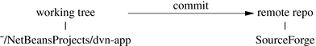
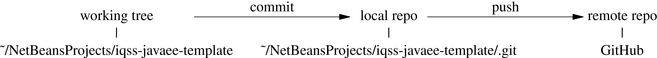
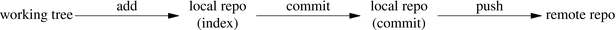

Now that we've cloned the iqss-javaee-template repo onto our laptop, we'll make an edit, **commit** it, and **push** it back up to GitHub.

## Publishing with svn

With svn, changes are published with a commit:

## Publishing with git

Changes are **not** published to GitHub until you **commit and push**:

## Highlights from "Team" menu

- Under Team, Git
    - Show Changes (`git status`)
    - Add (to the index)
    - Commit
    - Diff
    - Revert
        - Revert Modifications
        - Revert Commit
    - Remote 
        - Fetch
        - Pull
        - Push

## Before a commit... there is an "index" to stage your commit

## Making an edit to iqss-javaee-template

- Edit index.html
- Commit
- Push
- View commit at https://github.com/IQSS/iqss-javaee-template
