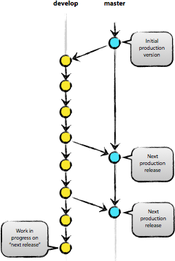

## Introduction

The goal of this "quickstart" is to switch your build environment from SourceForge to GitHub to produce a war file. To actually deploy the war to Glassfish on your workstation, you need to have PostgreSQL and the rest of your application environment set up per the DVN Developer's Guide at http://guides.thedata.org

In time, we'll incorporate all of this into the guide itself.

## New branching model: develop vs. master

Please note that with the move to git, we are adopting the branching model described at http://nvie.com/posts/a-successful-git-branching-model/

In this branching model there are two persistent branches:

- develop: where all new commits go
- master: where code gets merged and tagged as a release

That is to say, **please make your commits on the develop branch, not the master branch**. 

## Ensure you have a GitHub account

Please make sure your GitHub account is listed under `GITHUB_USERNAME` at https://github.com/dvn/dvn-sourceforge2github/blob/master/authors.tsv

## Set up an ssh keypair (if you haven't already)

You *can* use git with passwords over HTTPS but it's much nicer to set up SSH keys.

https://github.com/settings/ssh is the place to manage the ssh keys GitHub knows about for you. That page also links to a nice howto: https://help.github.com/articles/generating-ssh-keys

From the terminal, `ssh-keygen` will create new ssh keys for you:

- private key: `~/.ssh/id_rsa` 
    - It is **very important to protect your private key**. If someone else acquires it, they can access private repositories on GitHub and make commits as you! Ideally, you'll store your ssh keys on an encrypted volume and protect your private key with a password when prompted for one by `ssh-keygen`. See also "Why do passphrases matter" at https://help.github.com/articles/generating-ssh-keys
- public key: `~/.ssh/id_rsa.pub`

## Clone the repo

In NetBeans 7.1.1 or higher, click Team, then Git, then Clone.

### Remote Repository

- Repository URL: `github.com:IQSS/dvn.git`
- Username: `git`
- Private/Public Key
    - Private Key File: `/Users/[YOUR_USERNAME]/.ssh/id_rsa`
- Passphrase: (the passphrase you chose while running `ssh-keygen`) 

Click Next.

### Remote Branches

Under Select Remote Branches check both of these:

- `develop*`
- `master*`

Click Next.

### Destination Directory

- Parent Directory: `/Users/[YOUR_USERNAME]/NetBeansProjects`
- Clone Name: `dvn`
- Checkout Branch: `develop*`

Click Finish.

NetBeans should detect 5 projects. Click Open Project. Select DVN-web and check Open Required (so that DVN-ingest is also opened) and click Open.

Expect to see a dialog about reference problems. We need to configure libraries in NetBeans.

Please note that you should only have two projects open (DVN-web and DVN-ingest). If you click File -> Open Project you may see other projects such as DVN-EAR, DVN-EJB, and DVN-lockss but you should not open them or you will likely see build errors.

## Configure NetBeans libraries

Create the following 5 custom libraries using Tools -> Ant Libraries -> New Library:

- dvn-lib-COMMON
- dvn-lib-EJB
- dvn-lib-WEB
- dvn-lib-NETWORKDATA
- dvn-lib-NETWORKDATA-EXTRA

For each of these, simply select all the jar files from the directories

- lib/dvn-lib-COMMON
- lib/dvn-lib-EJB
- lib/dvn-lib-WEB
- lib/dvn-lib-NetworkData
- lib/dvn-lib-NetworkData-EXTRA

respectively.

Finally, add the following 5 JAR files in the Glassfish directory as compile-time libraries to your project:

In NetBeans, open the "Properties" menu of the DVN-web project; then go to Libraries. Add the following 5 jar files, on at a time:
 
- auto-depends.jar
- common-util.jar
- config-api.jar
- grizzly-config.jar
- internal-api.jar

by clicking on "Add JAR/Folder", then selecting each jar in the .../glassfish/modules directory of your 3.1.2 installation. (For example, /Applications/NetBeans/glassfish-3.1.2/glassfish/modules). Leave the "Package" box unchecked for each of these. 

## Pushing your commits to GitHub

By following the instructions above, you should be in the "develop" branch, which is where we want to make commits as we work toward the next release.

You can verify which branch you are on by clicking Team then "Repository Browser".

You should see `dvn [develop]` at the root of the tree and **develop** in bold under Branches -> Local

After making your commit, push it to GitHub by clicking Team -> Remote -> Push, then Next (to use your configured remote repository), then checking **develop** and Finish.

Your commit should now appear on GitHub in the develop branch: https://github.com/IQSS/dvn/commits/develop

Your commit should **not** appear in the master branch on GitHub: https://github.com/IQSS/dvn/commits/master  . Not yet anyway. Remember, we only merge commits into master when we are ready to release.

## Switching to the master branch to merge commits from the develop branch

We should really only need to switch from the develop branch to the master branch as we prepare for a release.

First, we check out the master branch by clicking Team -> Git -> Branch -> Switch to Branch.

Change Branch to "origin/master" and check the box for "Checkout as New Branch" and fill in "master" as the "Branch Name" to match the name of the branch we're switching to. Then click "Switch".

Now, in the Git Repository Browser (from Team -> Repository Browser) the root of the tree should say `dvn [master]` and you should see two branches under Branches -> Local. **master** should be in bold and develop should not.

FIXME: explain how to merge commits into master for a final release (and how to tag the release)

## If you commit and push to the `master` branch by mistake...

If no one has fetched the bad commit, you can try to remove the commit from your local git repo and GitHub by (carefully) following http://christoph.ruegg.name/blog/2010/5/5/git-howto-revert-a-commit-already-pushed-to-a-remote-reposit.html

## Files changed by NetBeans during a clone

After cloning the project from GitHub, NetBeans 7.2.1 seems to change a number of files even before you do anything...

    murphy:dvn pdurbin$ git status
    # On branch develop
    # Changes not staged for commit:
    #   (use "git add <file>..." to update what will be committed)
    #   (use "git checkout -- <file>..." to discard changes in working directory)
    #
    #       modified:   src/DVN-ingest/nbproject/build-impl.xml
    #       modified:   src/DVN-ingest/nbproject/genfiles.properties
    #       modified:   src/DVN-web/nbproject/genfiles.properties
    #       modified:   src/DVN-web/nbproject/jaxws-build.xml
    #       modified:   src/DVN-web/nbproject/project.properties
    #
    # Untracked files:
    #   (use "git add <file>..." to include in what will be committed)
    #
    #       .gitignore
    #       src/DVN-web/nbproject/build-impl.xml
    no changes added to commit (use "git add" and/or "git commit -a")
    murphy:dvn pdurbin$ 

... it's not entirely clear if these files should be commited to the local repo and pushed to GitHub. See also http://irclog.iq.harvard.edu/dvn/2013-01-15#i_363 and https://redmine.hmdc.harvard.edu/issues/1188#note-13
